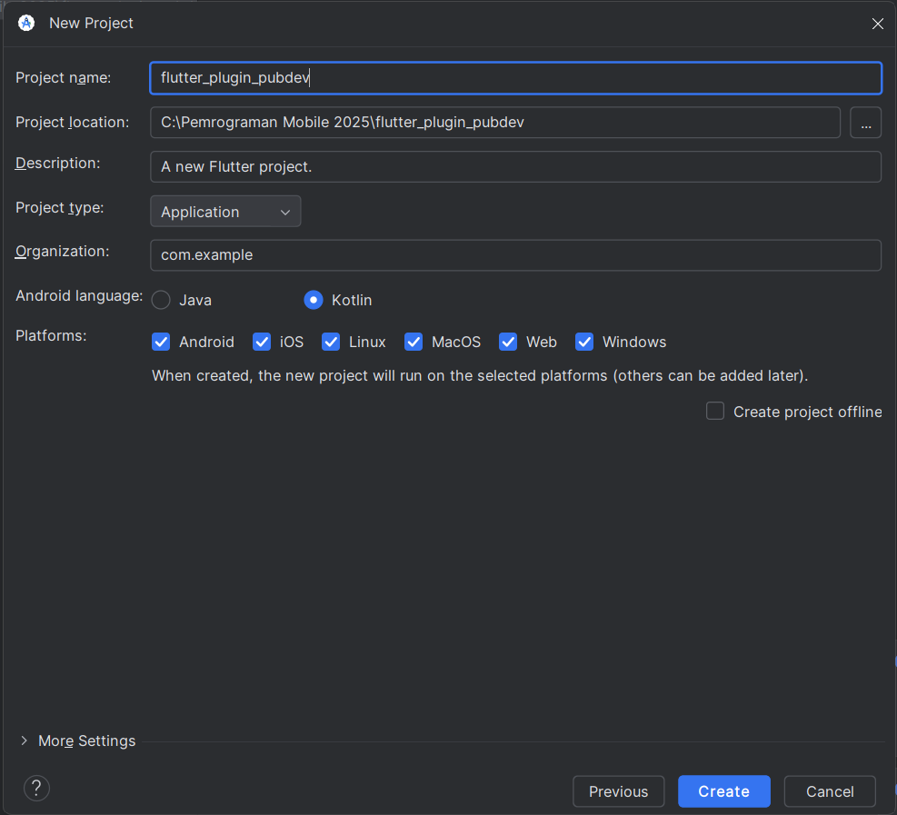
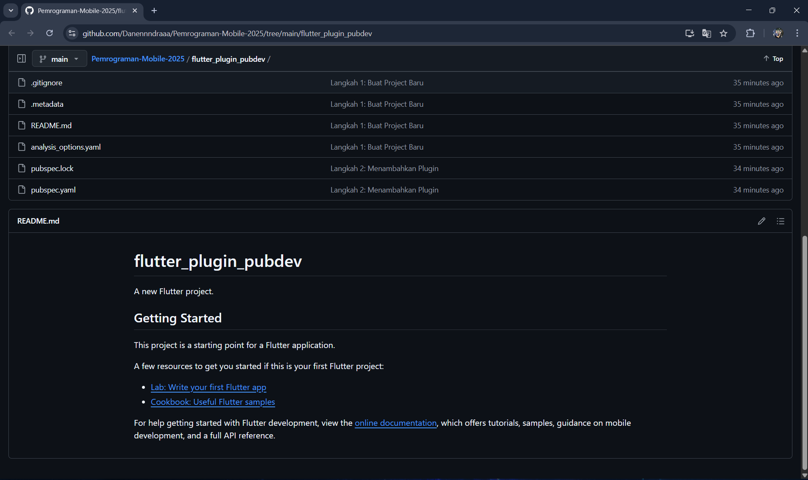
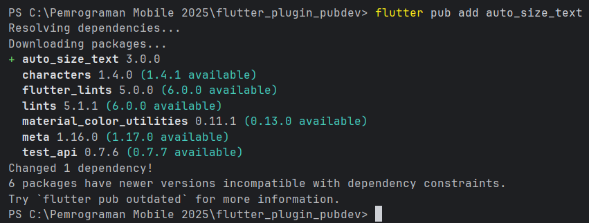
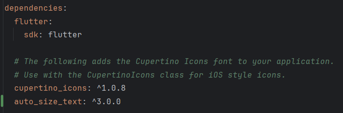
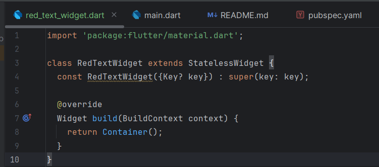
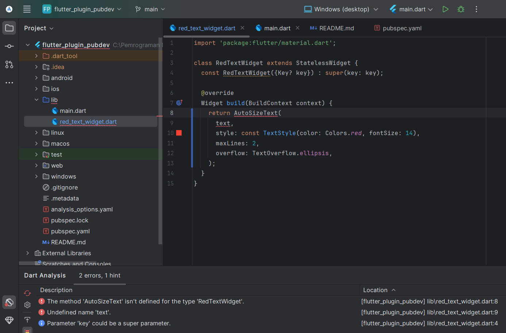
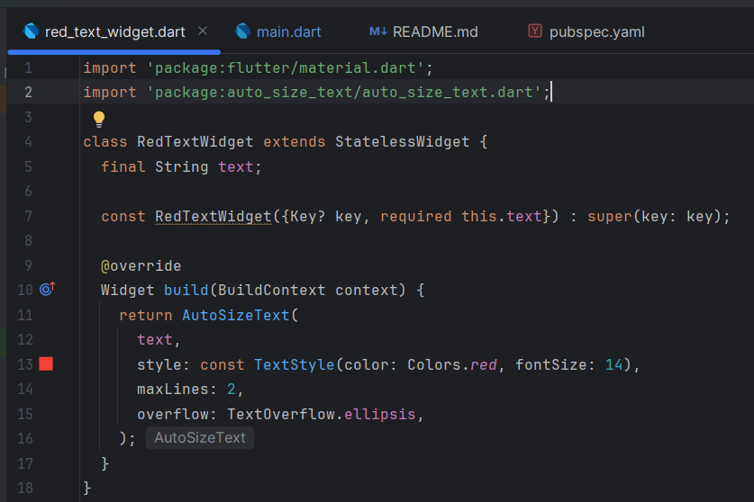
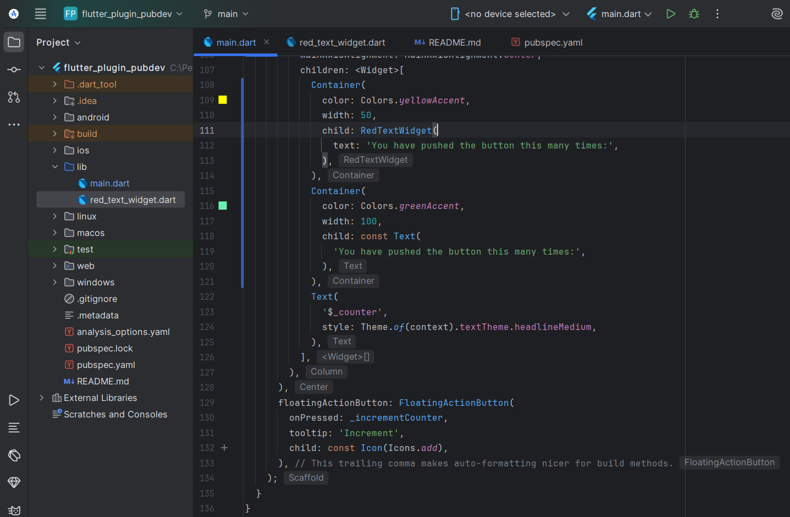
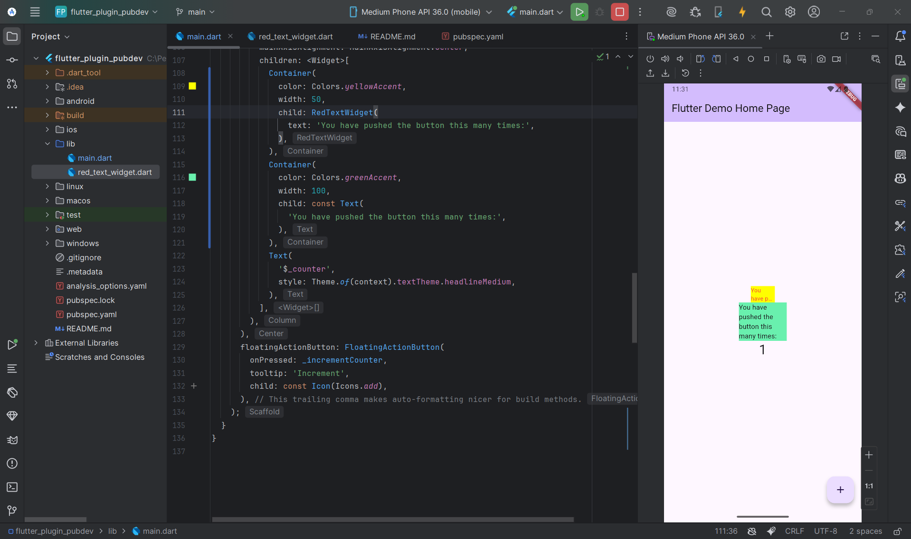

# flutter_plugin_pubdev

A new Flutter project.

## Documentations
`flutter_plugin_pubdev`: Danendra Adhipramana - 244107023011

## Langkah 1: Buat Project Baru
Saya sebuah project flutter baru dengan nama `flutter_plugin_pubdev`. 


Lalu saya push ke github repository di GitHub Anda dengan nama `flutter_plugin_pubdev`.


## Langkah 2: Menambahkan Plugin
Saya Tambahkan plugin `auto_size_text` menggunakan perintah berikut di terminal


Jika berhasil, maka akan tampil nama plugin beserta versinya di file `pubspec.yaml` pada bagian dependencies.


## Langkah 3: Buat file `red_text_widget.dart`
Saya membuat file baru bernama `red_text_widget.dart` di dalam folder lib lalu isi kode seperti berikut.



## Langkah 4: Tambah Widget `AutoSizeText`
Kemudian saya mengubah kode `return Container()` menjadi seperti berikut.


Setelah Anda menambahkan kode di atas, Anda akan mendapatkan info error. Mengapa demikian? Jelaskan dalam laporan praktikum Anda!
Jawaban:
Error terjadi karena variabel text belum dideklarasikan atau belum dikenali dalam kelas RedTextWidget.

Kode yang menyebabkan error:

```dart
return AutoSizeText(
  text,  // <-- text belum didefinisikan!
  style: const TextStyle(color: Colors.red, fontSize: 14),
  maxLines: 2,
  overflow: TextOverflow.ellipsis,
);
```

Flutter tidak tahu nilai dari `text` itu berasal dari mana, karena kita belum membuat variabel atau parameter yang menampung teks tersebut.

Solusinya dilakukan pada Langkah 5, yaitu dengan menambahkan variabel text dan parameter konstruktor agar widget menerima teks dari luar.


## Langkah 5: Buat Variabel text dan parameter di constructor
Saya menambahkan variabel `text` dan parameter di constructor seperti berikut.



## Langkah 6: Tambahkan widget di main.dart
Didalam file `main.dart` lalu saya tambahkan di dalam `children: `pada  `class _MyHomePageState`



## Run APP
Ketika Aplikasi dijalankan, hasilnya sebagai berikut:



## Tugas Praktikum: Jelaskan maksud dari langkah 2 pada praktikum tersebut!
Jawaban:
Langkah 2 bertujuan untuk menambahkan dependensi (plugin eksternal) bernama `auto_size_text` ke dalam proyek Flutter melalui perintah:

>flutter pub add auto_size_text


Plugin ini tidak termasuk dalam pustaka bawaan Flutter, sehingga harus diunduh dari pub.dev — repositori resmi paket Flutter dan Dart.

Setelah menjalankan perintah ini, Flutter akan otomatis menambahkan plugin tersebut ke dalam file `pubspec.yaml` di bagian `dependencies:`, contohnya:

```dart
dependencies:
  flutter:
    sdk: flutter
  auto_size_text: ^3.0.0
```


>Dengan demikian, kita bisa mengimpor dan menggunakan fitur-fitur dari plugin auto_size_text di dalam kode, seperti AutoSizeText, yang mampu menyesuaikan ukuran teks secara otomatis agar sesuai dengan batas lebar/tinggi widget.

## Tugas Praktikum: Jelaskan maksud dari langkah 5 pada praktikum tersebut!
Jawaban:
Langkah 5 bertujuan untuk mendefinisikan variabel yang digunakan dalam widget dan membuat konstruktor agar widget dapat menerima input teks dari luar.

Kode yang ditambahkan:

```dart
final String text;

const RedTextWidget({Key? key, required this.text}) : super(key: key);
```

Penjelasan:

`final String text;`  → Mendeklarasikan variabel `text` bertipe String yang berisi teks yang akan ditampilkan.

`required this.text` → Menandakan bahwa parameter `text` wajib diisi saat membuat objek `RedTextWidget`.

Dengan ini, widget `RedTextWidget` bisa dipanggil seperti:
```dart
const RedTextWidget(text: 'Hello Flutter!');
```

Sehingga variabel text kini memiliki nilai, dan error di langkah 4 akan hilang.

## Pada langkah 6 terdapat dua widget yang ditambahkan, jelaskan fungsi dan perbedaannya!
Jawaban:
Di langkah ini ada dua widget yang ditambahkan di dalam children: yaitu:

```dart
Container(
   color: Colors.yellowAccent,
   width: 50,
   child: const RedTextWidget(
             text: 'You have pushed the button this many times:',
          ),
),
Container(
    color: Colors.greenAccent,
    width: 100,
    child: const Text(
           'You have pushed the button this many times:',
          ),
),

```

| Komponen | Fungsi | Ciri Khas / Perbedaan | 
|------|------|------|
|  `RedTextWidget` (kuning) | Menggunakan plugin `auto_size_text`, sehingga teks menyesuaikan ukuran otomatis agar muat di dalam lebar kontainer (50 piksel). | - Teks berwarna merah. Ukuran font dapat mengecil otomatis. Teks panjang tidak terpotong karena auto resize. | 
| `Text` biasa (hijau) | Menggunakan widget `Text` bawaan Flutter tanpa penyesuaian otomatis. | - Teks berwarna hitam default. Jika teks terlalu panjang untuk lebar 100 piksel, teks akan terpotong atau meluap tanpa menyesuaikan ukuran font. | 

Jadi, perbedaan utama adalah:

`AutoSizeText` dari plugin menyesuaikan ukuran teks otomatis agar tetap terlihat utuh dalam batas ruangnya, sedangkan `Text` biasa tidak.

## Tugas Praktikum: Jelaskan maksud dari tiap parameter yang ada di dalam plugin auto_size_text berdasarkan tautan pada dokumentasi [ini](https://pub.dev/documentation/auto_size_text/latest/) !
Jawaban:

### Dokumentasi Plugin Flutter `auto_size_text`

### Deskripsi
`auto_size_text` adalah plugin Flutter yang digunakan untuk menampilkan teks yang **secara otomatis menyesuaikan ukuran font-nya** agar muat di dalam batas ruang yang tersedia.  
Plugin ini sangat berguna ketika kita ingin membuat tampilan teks yang tetap rapi pada berbagai ukuran layar.

---

### Konstruktor Utama

```dart
AutoSizeText(
  String data, {
  Key? key,
  Key? textKey,
  TextStyle? style,
  StrutStyle? strutStyle,
  double minFontSize = 12,
  double maxFontSize = double.infinity,
  double stepGranularity = 1,
  List<double>? presetFontSizes,
  AutoSizeGroup? group,
  TextAlign? textAlign,
  TextDirection? textDirection,
  Locale? locale,
  bool? softWrap,
  bool wrapWords = true,
  TextOverflow? overflow,
  Widget? overflowReplacement,
  double? textScaleFactor,
  int? maxLines,
  String? semanticsLabel,
})
```
### Daftar Parameter dan Penjelasannya

| Parameter | Tipe Data | Nilai Default | Deskripsi |
|------------|------------|----------------|------------|
| **`key`** | `Key?` | – | Kunci widget untuk identifikasi unik di widget tree Flutter. |
| **`textKey`** | `Key?` | – | Kunci untuk widget `Text` internal di dalam `AutoSizeText`. |
| **`style`** | `TextStyle?` | – | Mengatur gaya tampilan teks seperti warna, ukuran font awal, dan ketebalan. Nilai `fontSize` menjadi titik awal resizing. |
| **`strutStyle`** | `StrutStyle?` | – | Menentukan tinggi baris (line height) dan jarak antar baris teks agar konsisten. |
| **`minFontSize`** | `double` | `12` | Ukuran **font minimum** yang diizinkan. Jika teks tetap tidak muat meskipun sudah sekecil ini, `overflow` akan diterapkan. |
| **`maxFontSize`** | `double` | `double.infinity` | Ukuran **font maksimum** yang diizinkan. Membatasi agar teks tidak terlalu besar. |
| **`stepGranularity`** | `double` | `1` | Besaran langkah penurunan ukuran font ketika menyesuaikan ukuran. Semakin kecil, semakin halus tapi lebih lambat. |
| **`presetFontSizes`** | `List<double>?` | `null` | Daftar ukuran font yang diizinkan secara spesifik. Jika diisi, parameter `minFontSize`, `maxFontSize`, dan `stepGranularity` akan diabaikan. |
| **`group`** | `AutoSizeGroup?` | – | Menghubungkan beberapa `AutoSizeText` agar memiliki ukuran font yang **selaras** (mengikuti ukuran terkecil di antara mereka). |
| **`textAlign`** | `TextAlign?` | – | Menentukan perataan teks: kiri (`left`), kanan (`right`), tengah (`center`), atau rata (`justify`). |
| **`textDirection`** | `TextDirection?` | – | Menentukan arah teks (LTR = kiri ke kanan, RTL = kanan ke kiri). |
| **`locale`** | `Locale?` | – | Menentukan lokal bahasa untuk pemilihan font dan aturan teks. |
| **`softWrap`** | `bool?` | – | Menentukan apakah teks dapat membungkus secara otomatis pada batas baris. |
| **`wrapWords`** | `bool` | `true` | Jika `false`, kata panjang tidak akan dipotong atau dibungkus, melainkan bisa meluap keluar batas. |
| **`overflow`** | `TextOverflow?` | – | Menentukan perilaku ketika teks meluap: `ellipsis` (…), `clip`, atau `fade`. |
| **`overflowReplacement`** | `Widget?` | – | Widget pengganti yang ditampilkan jika teks tetap overflow meski sudah diperkecil sampai `minFontSize`. |
| **`textScaleFactor`** | `double?` | – | Faktor skala teks. Mempengaruhi perhitungan ukuran font akhir. |
| **`maxLines`** | `int?` | – | Batas **jumlah baris maksimum** teks. Jika melebihi, teks akan disesuaikan atau dipotong sesuai aturan `overflow`. |
| **`semanticsLabel`** | `String?` | – | Label alternatif untuk **aksesibilitas (screen reader)**. Membantu pengguna tunanetra memahami isi teks. |

### Perilaku Penting

- `AutoSizeText` akan mengambil ukuran awal dari `style.fontSize`, lalu menyesuaikannya agar muat dalam batas widget.

- Jika `presetFontSizes` digunakan, maka parameter `minFontSize`, `maxFontSize`, dan `stepGranularity` tidak digunakan.

- Jika teks masih overflow meskipun sudah di `minFontSize`, maka akan diterapkan `overflow` atau `overflowReplacement`.

- `group` digunakan agar beberapa `AutoSizeText` memiliki ukuran font yang seragam (misalnya dalam layout tabel atau grid).

- Widget induk harus memiliki batas lebar/tinggi tertentu (constraints), karena jika tidak, `AutoSizeText` tidak tahu seberapa jauh ia boleh menyesuaikan teks.

- Nilai `stepGranularity` terlalu kecil bisa memperlambat proses render karena perhitungan ukuran dilakukan berulang kali.

### Contoh Penggunaan

```dart
import 'package:flutter/material.dart';
import 'package:auto_size_text/auto_size_text.dart';

class ExamplePage extends StatelessWidget {
  const ExamplePage({super.key});

  @override
  Widget build(BuildContext context) {
    return Scaffold(
      body: Center(
        child: Container(
          color: Colors.yellowAccent,
          width: 80,
          child: const AutoSizeText(
            'Contoh teks yang akan menyesuaikan ukuran font-nya secara otomatis.',
            style: TextStyle(color: Colors.red, fontSize: 20),
            maxLines: 2,
            minFontSize: 10,
            overflow: TextOverflow.ellipsis,
          ),
        ),
      ),
    );
  }
}
```
### Sumber Resmi
[Dokumentasi Plugin auto_size_text di pub.dev](https://pub.dev/documentation/auto_size_text/latest/)

> Disusun oleh: Danendra Adhipramana -  244107023011

>Flutter Plugin Pub.dev — AutoSizeText
