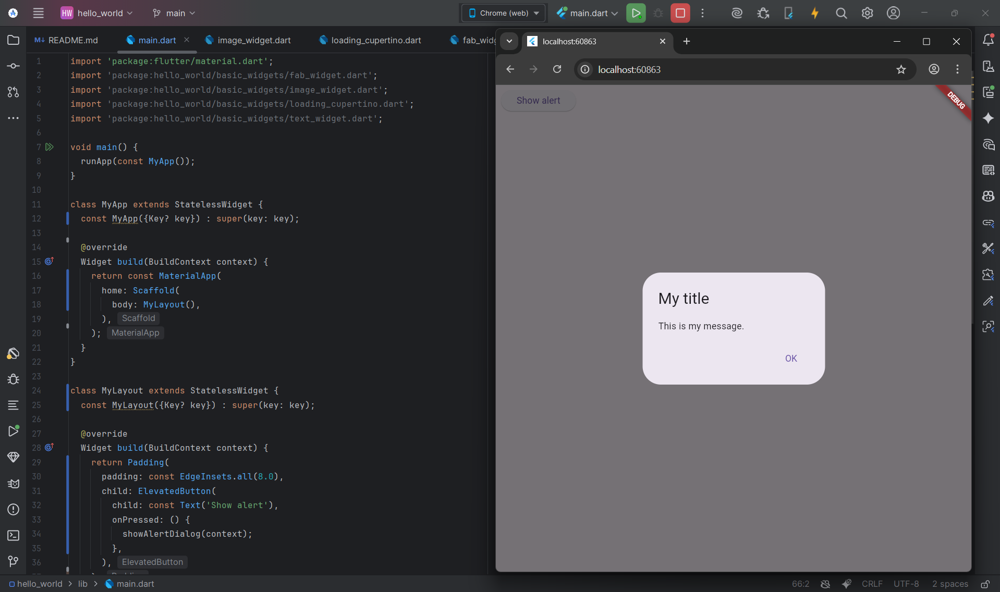

# hello_world

A new Flutter project.

## Documentation

## Praktikum 1: Membuat Project Flutter Baru
Membuat Project Flutter Baru di Android Studio.

## Praktikum 2: Menghubungkan Perangkat Android atau Emulator
Mengkoneksikan Perangkat Fisik via Wireless untuk melakukan Debugging.

jika sudah terkoneksi, dapat dimunculkan atau mirror di android Studio.

Menjalankan aplikasi hello_world, Capture hasil aplikasi di perangkat.

## Praktikum 3: Membuat Repository GitHub dan Laporan Praktikum
Membuat Repositori GitHub

Isi Readme MD

## Praktikum 4: Menerapkan Widget Dasar
Langkah 1: Text Widget

Langkah 2: Image Widget

penyesuaian asset pada file pubspec.yaml

## Praktikum 5: Menerapkan Widget Material Design dan iOS Cupertino
Langkah 1: Cupertino Button dan Loading Bar

Langkah 2: Floating Action Button (FAB)

Langkah 3: Scaffold Widget

Langkah 4: Dialog Widget

Langkah 5: Input dan Selection Widget

Langkah 6: Date and Time Pickers
