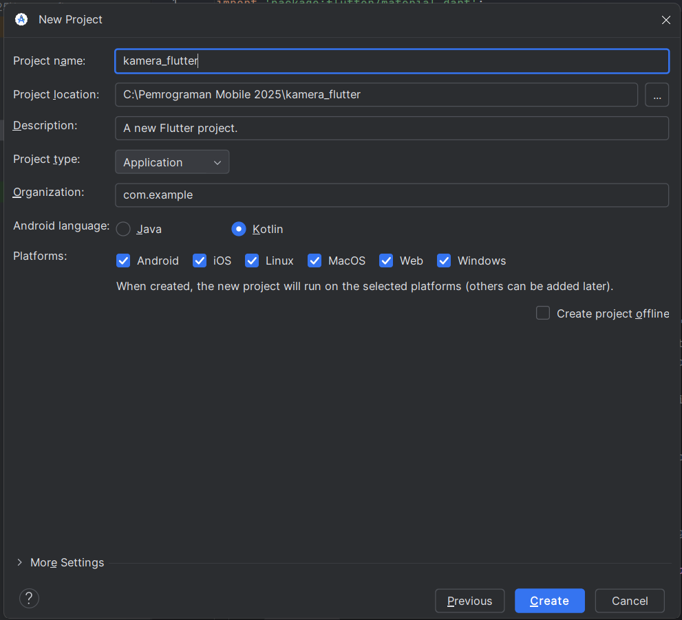
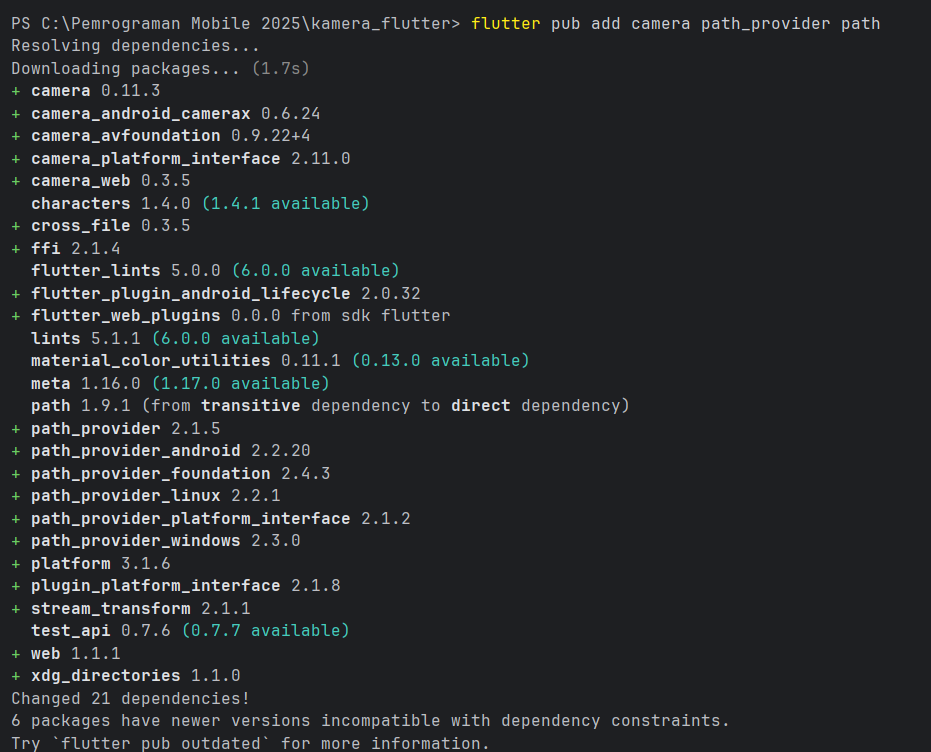
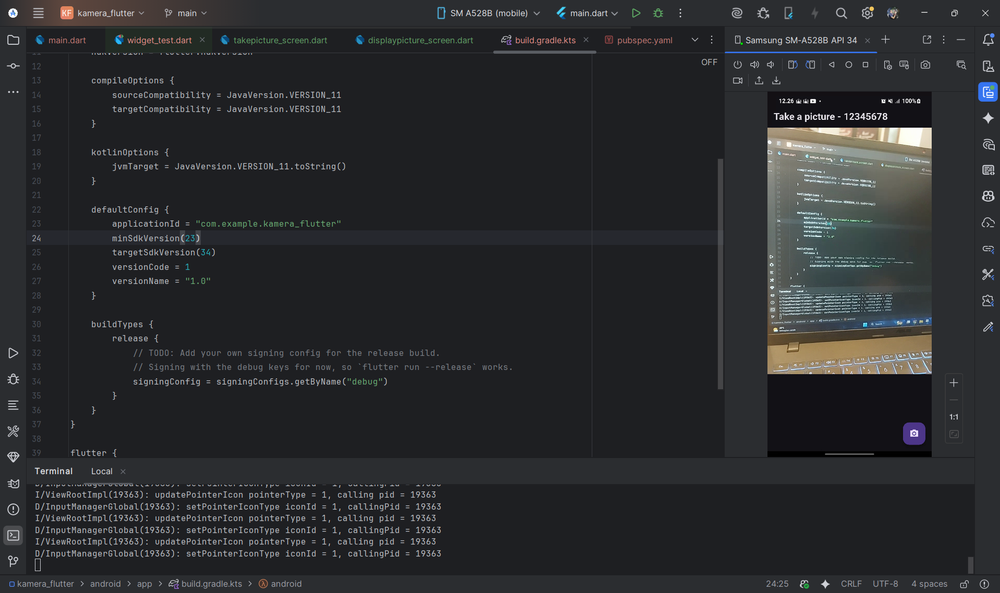
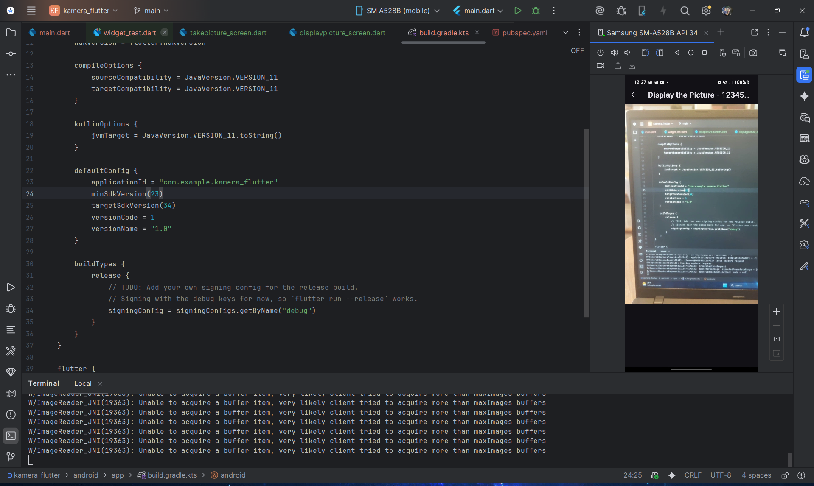
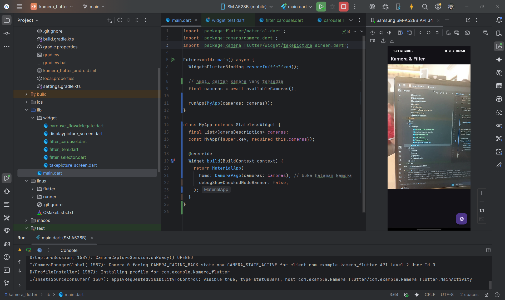
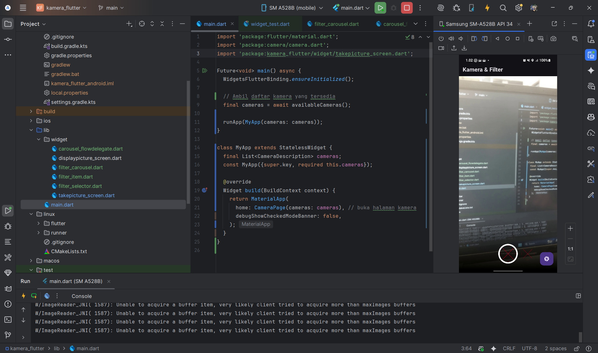
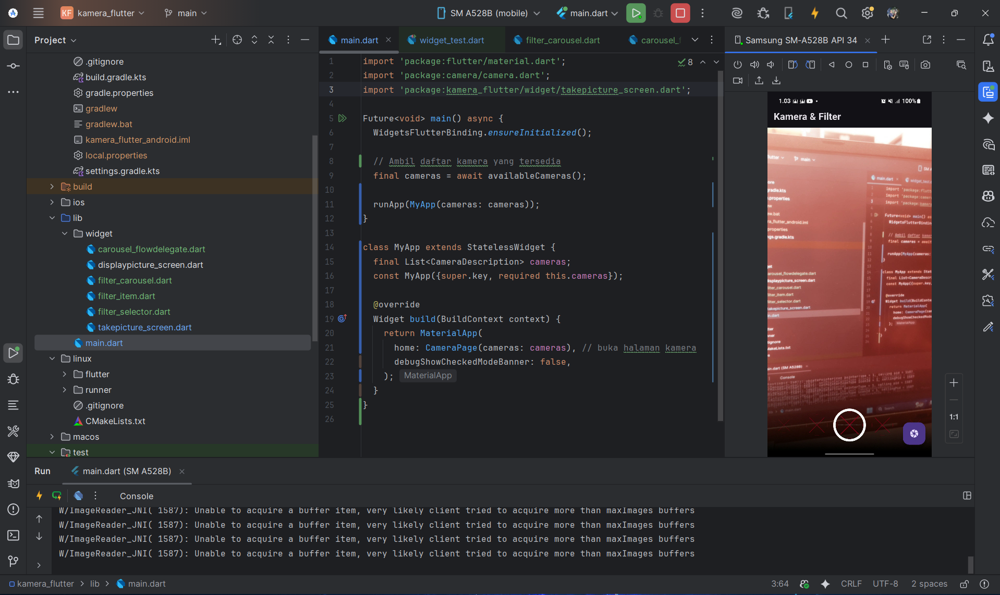
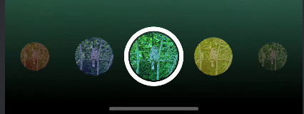

# kamera_flutter

A new Flutter project.

## Documentation

`Kamera Flutter`: Danendra Adhipramana - 09 - TI - 3D - 244107023011

## Praktikum 1: Mengambil Foto dengan Kamera di Flutter

### Membuat Project Baru
saya membuat sebuah project flutter baru dengan nama `Kamera_flutter`.

### Menambah dependensi yang diperlukan
saya menambah dependensi yang diperlukan

`camera` → menyediakan seperangkat alat untuk bekerja dengan kamera pada device.

`path_provider` → menyediakan lokasi atau path untuk menyimpan hasil foto.

`path` → membuat path untuk mendukung berbagai platform.

### hasil pekerjaan Praktikum 1

saya deploy pada device atau smartphone saya, ini merupakan tampilan awal atau utama aplikasi.

saat di klik ikon kamera pada pojok, foto berhasil ditangkap.

## Praktikum 2: Membuat photo filter carousel

> [!WARNING]
> Disini saya **tidak** membuat project baru bernama `photo_filter_carousel`, tetapi saya akan melanjutkan project yang sebelumnya telah dibuat, yaitu project `kamera_flutter`.

### hasil pekerjaan Praktikum 2
saya deploy pada device atau smartphone saya, ini merupakan tampilan awal atau utama aplikasi.

saat di klik ikon kamera pada pojok, foto berhasil ditangkap. tetapi dengan circle ditengah yang bisa di swipe untuk memilih filter

saat di swipe akan menampilkan beberapa filter warna

> [!WARNING]
> Untuk memperbaiki ikon filter (lingkaran bertekstur) muncul sebagai tanda “X merah” alias missing image. diperlukan url aktif yang diubah atau di replace di bagian `filter_item.dart`

## Tugas Praktikum

1. Jelaskan maksud void async pada praktikum 1?

    > async → Menandakan fungsi berjalan asynchronous (dapat menunggu proses lain selesai).

    > await → Menunggu hasil proses asynchronous.

    > Future<void> → Menandakan fungsi akan mengembalikan hasil di masa depan, tanpa nilai (void).

>Kesimpulan:
Future<void> main() async digunakan agar Flutter dapat menunggu proses inisialisasi kamera selesai sebelum aplikasi dijalankan.

2. Jelaskan fungsi dari anotasi @immutable dan @override ?
    > @immutable digunakan pada class widget untuk menandakan bahwa semua properti di dalamnya tidak boleh diubah setelah objek dibuat.

    > @override Digunakan untuk menimpa method dari superclass (misalnya initState(), build(), dispose()).