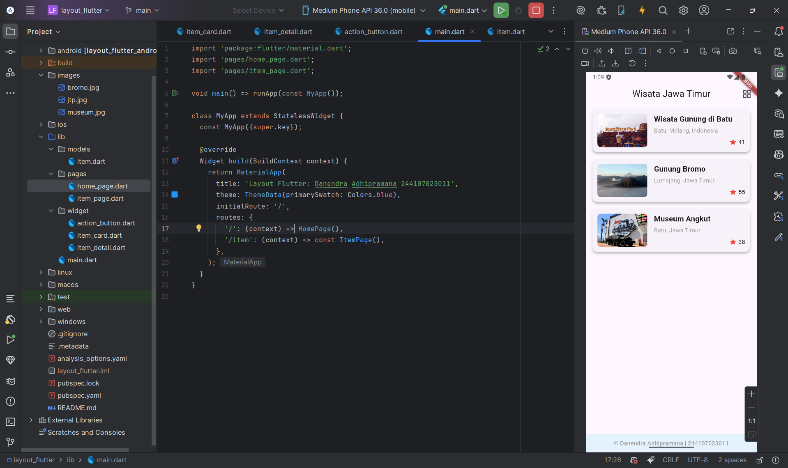

# layout_flutter

A new Flutter project.

## Documentations
`Layout Flutter`: Danendra Adhipramana - 244107023011

## Praktikum 1: Membangun Layout di Flutter

### Membuat Project Baru
saya membuat sebuah project flutter baru dengan nama `layout_flutter`.

### Buka file `lib/main.dart`
saya membuka file main.dart lalu mengganti dengan nama dan NIM Anda di text title dan memunculkan hello world.

### Implementasi title row
saya membangun layout di flutter dengan mengimplementasikan title row dengan hasil berikut.

## Praktikum 2: Implementasi button row
saya membangun button di flutter dengan membuat method column buildbutton dan membuat widgetbutton dengan hasil berikut.

## Praktikum 3: Implementasi text section
saya membuat text di flutter dengan membuat widget textSection dengan hasil berikut.

## Praktikum 4: Implementasi image section
saya memgimplementasikan image di flutter dengan menyisipkan aset gambar dan menambahkan gambar ke body dengan hasil berikut.

## Praktikum 5: Membangun Navigasi di Flutter

> [!WARNING]
> Disini saya **tidak** membuat project baru bernama "belanja", tetapi saya akan melanjutkan project yang sebelumnya telah dibuat, yaitu project "layout_flutter".

saya membuat Homepage dengan tampilan listview dan berikut hasilnya

ketika di klik akan memunculkan halaman Detail Card, dan dapat kembali ke homepage dengan menekan tombol back. Berikut Hasilnya

## Tugas Praktikum 2: Navigator
Saya mengirim Data dengan Arguments
Di dalam `item_card.dart`, saya mengubah aksi onTap agar mengirim data ke halaman detail:

## Tugas Praktikum 2: Modal Route
kemudian setelah mengirim data akan Terima Data di ItemPage
Di dalam `item_page.dart`, dengan mengambil argumen dengan ModalRoute:

## Tugas Praktikum 2: GridView <> ListView
tampilan awal project ini adalah ListView

kemudian saya membuat GridView dan menambahkan tombol agar dapat berubah dari listview ke gridview begitu sebaliknya, berikut hasilnya.

## Tugas Praktikum 2: Hero Widget
Saya menambahkan Hero Animation
Untuk membuat transisi halus dari gambar di HomePage ke gambar di ItemPage, dengan cara tambahkan Hero widget Di `item_card.dart,

## Tugas Praktikum 2: Footer
saya menambahkan Footer Identitas
Di bawah ListView/GridView dengan nama dan NIM
