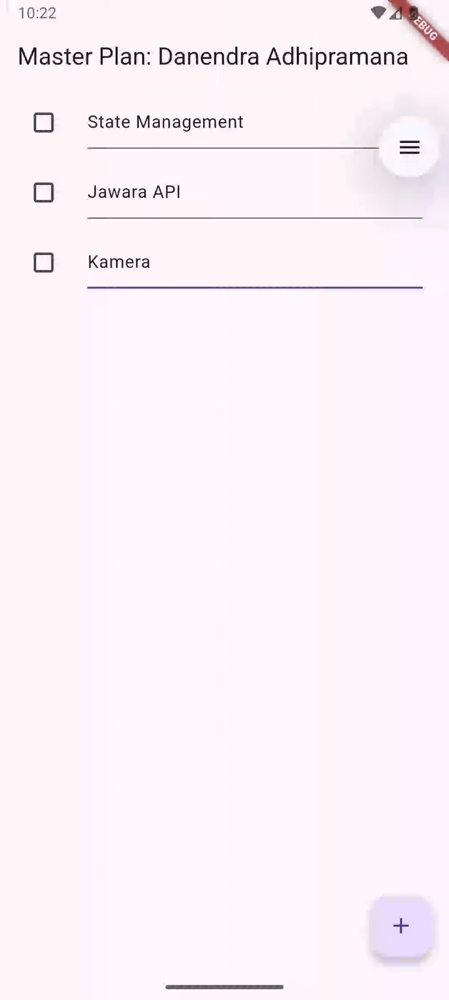
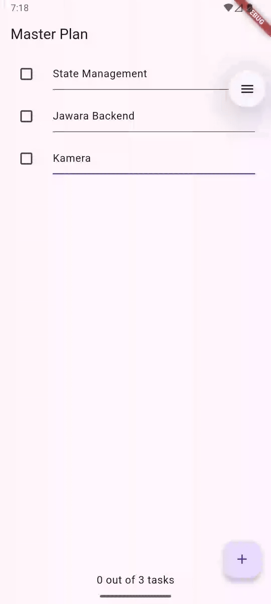
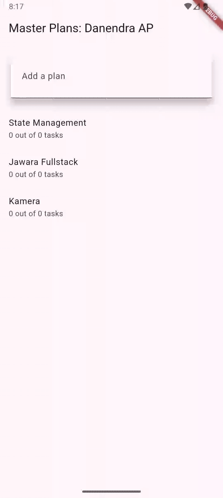

# master_plan

A new Flutter project.

## Documentation

### Laporan Praktikum: Manajemen State pada Flutter

**Nama:** Danendra Adhipramana  
**NIM:** 244107023011
**Kelas:** TI - 3D
**Absen:** 09
**Mata Kuliah:** Pemrograman Mobile

---

## 📚 Daftar Isi
- [Praktikum 1: Dasar State dengan Model-View](#praktikum-1-dasar-state-dengan-model-view)
- [Praktikum 2: Mengelola Data Layer dengan InheritedWidget](#praktikum-2-mengelola-data-layer-dengan-inheritedwidget)
- [Praktikum 3: Membuat State di Multiple Screens](#praktikum-3-membuat-state-di-multiple-screens)

---

## Praktikum 1: Dasar State dengan Model-View

Pada praktikum ini, kita membangun dasar aplikasi "Master Plan" menggunakan konsep dasar `StatefulWidget` untuk mengelola state lokal di dalam satu layar. Aplikasi ini memungkinkan pengguna untuk membuat daftar tugas (todo list) dan mencentangnya.

### 1. Deskripsi Langkah-Langkah
1.  Membuat struktur folder `models` dan `views`.
2.  Membuat model data `Task` dan `Plan`.
3.  Mengimplementasikan `PlanScreen` sebagai `StatefulWidget`.
4.  Menambahkan fitur scroll listener untuk menyembunyikan keyboard saat menggulir layar.

### 2. Jawaban Tugas Praktikum

**1. Jelaskan maksud dari langkah 4 pada praktikum tersebut! Mengapa dilakukan demikian?**
> Langkah 4 membuat file `data_layer.dart` yang berisi `export 'plan.dart'` dan `export 'task.dart'`. Ini disebut teknik **Barrel File**. Tujuannya adalah untuk membungkus beberapa import menjadi satu pintu masuk. Dengan cara ini, file lain yang membutuhkan model cukup mengimpor `data_layer.dart` saja, membuat kode impor menjadi lebih ringkas dan rapi.

**2. Mengapa perlu variabel plan di langkah 6 pada praktikum tersebut? Mengapa dibuat konstanta?**
> Variabel `plan` diperlukan untuk menyimpan data state dari rencana (objek `Plan`) yang akan ditampilkan dan diubah di layar.
> Inisialisasi awal menggunakan `const Plan()` karena objek `Plan` dan `Task` didesain bersifat *immutable* (tidak bisa diubah langsung). Penggunaan `const` di awal bertujuan untuk efisiensi memori (canonicalization) saat aplikasi pertama kali dimuat dengan data kosong.

**3. Apa kegunaan method pada Langkah 11 dan 13 dalam lifecyle state?**
> * **`initState()` (Langkah 11):** Dipanggil sekali saat widget pertama kali dibuat. Digunakan untuk menginisialisasi `ScrollController` dan menambahkan listener untuk menghilangkan fokus keyboard saat scroll.
> * **`dispose()` (Langkah 13):** Dipanggil saat widget dihapus dari tree. Digunakan untuk memanggil `scrollController.dispose()` guna mencegah kebocoran memori (memory leak).

### 3. Hasil Praktikum (GIF)

---

## Praktikum 2: Mengelola Data Layer dengan InheritedWidget

Pada praktikum ini, kita memisahkan logika data dari UI menggunakan `InheritedNotifier`. Ini memungkinkan state diakses oleh widget di bawahnya (descendants) tanpa perlu melempar parameter secara manual (prop drilling), serta menambahkan fitur penghitung kelengkapan tugas.

### 1. Deskripsi Langkah-Langkah
1.  Membuat `PlanProvider` yang mewarisi `InheritedNotifier`.
2.  Membungkus `MaterialApp` dengan `PlanProvider`.
3.  Menambahkan logika getter `completedCount` dan `completenessMessage` pada model.
4.  Mengupdate UI untuk mengambil data dari Provider dan menampilkan status kelengkapan di footer (`SafeArea`).

### 2. Jawaban Tugas Praktikum

**1. Jelaskan mana yang dimaksud InheritedWidget pada langkah 1 tersebut! Mengapa yang digunakan InheritedNotifier?**
> `PlanProvider` adalah kelas yang mewarisi `InheritedNotifier`. `InheritedNotifier` sendiri adalah turunan dari `InheritedWidget`.
> Kita menggunakan `InheritedNotifier` (bukan `InheritedWidget` biasa) karena kita ingin widget anak melakukan *rebuild* otomatis setiap kali objek `ValueNotifier` (data plan) berubah nilainya. Ini membuat pengelolaan state menjadi reaktif tanpa perlu logika manual di `updateShouldNotify`.

**2. Jelaskan maksud dari method di langkah 3 pada praktikum tersebut! Mengapa dilakukan demikian?**
> Method `completedCount` menghitung jumlah tugas yang selesai, dan `completenessMessage` menghasilkan string status (misal: "3 out of 5 tasks").
> Hal ini dilakukan di dalam Model (`plan.dart`) untuk menerapkan prinsip **Separation of Concerns**. Logika bisnis/perhitungan diletakkan di Model, sedangkan View hanya bertugas menampilkannya. Ini membuat kode lebih bersih dan mudah dites.

### 3. Hasil Praktikum (GIF)

---

## Praktikum 3: Membuat State di Multiple Screens

Pada praktikum terakhir, aplikasi dikembangkan menjadi dua layar: layar utama untuk membuat daftar kategori Rencana, dan layar detail untuk mengisi tugas-tugas di dalamnya. State kini mengelola `List<Plan>` secara global.

### 1. Deskripsi Langkah-Langkah
1.  Mengupdate `PlanProvider` untuk menangani `List<Plan>`.
2.  Membuat screen baru `PlanCreatorScreen` sebagai halaman awal.
3.  Menambahkan navigasi (`Navigator.push`) dari Creator Screen ke Plan Screen.
4.  Menambahkan pengaman error (Safe Indexing) untuk mencegah crash saat Hot Restart.

### 2. Jawaban Tugas Praktikum

**1. Berdasarkan Praktikum 3 yang telah Anda lakukan, jelaskan maksud dari gambar diagram berikut ini!**
> Diagram tersebut menggambarkan struktur **Widget Tree** dan alur **Navigasi**:
> * **Kiri (`PlanCreatorScreen`):** Merupakan struktur UI halaman awal yang terdiri dari TextField dan ListView.
> * **Panah (`Navigator Push`):** Menunjukkan transisi perpindahan halaman.
> * **Kanan (`PlanScreen`):** Merupakan struktur UI halaman detail.
> * **`PlanProvider`:** Terletak di puncak (root) di atas kedua layar tersebut. Ini bermakna data state tersentralisasi, sehingga perubahan data di layar detail (`PlanScreen`) tetap tersimpan dan bisa diakses kembali saat pengguna kembali ke layar utama (`PlanCreatorScreen`).

### 3. Hasil Praktikum (GIF)

---